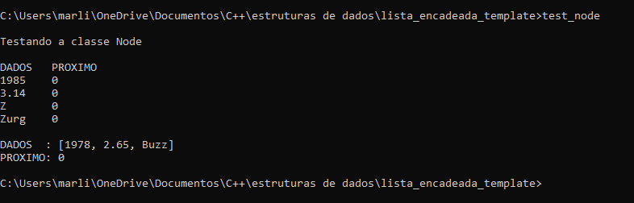
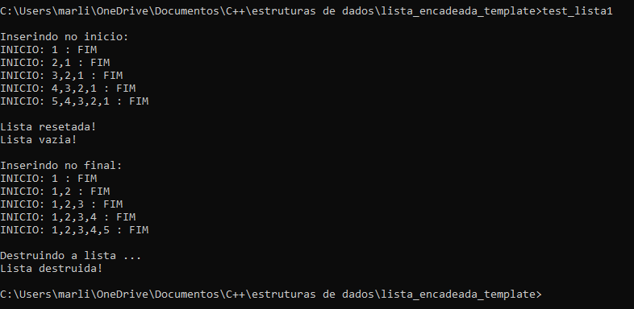
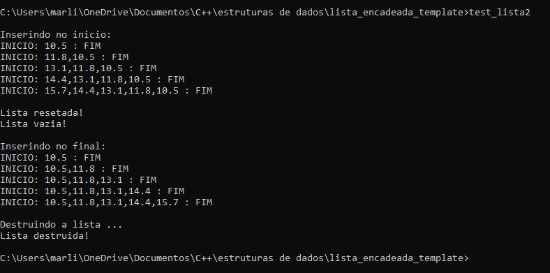
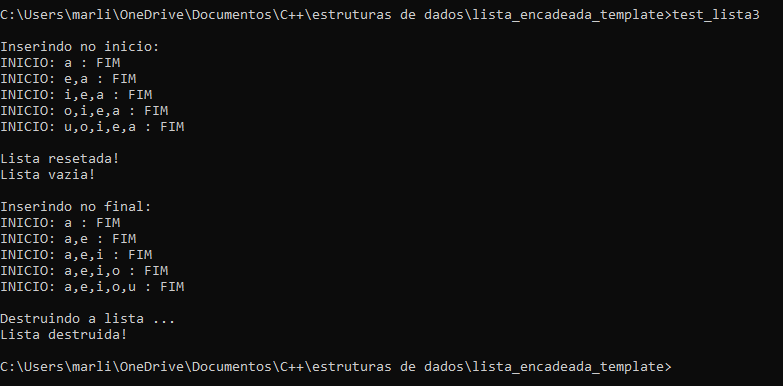
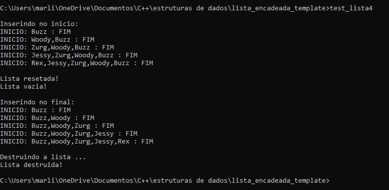
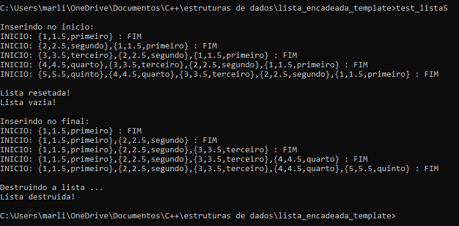
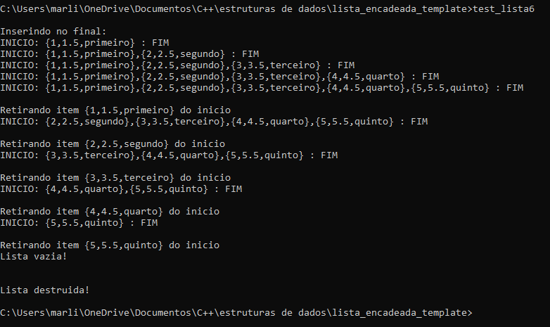
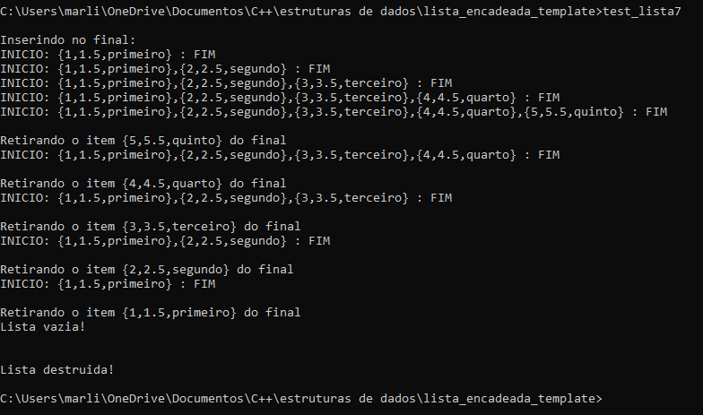

# Lista encadeada genérica

### Arquivos
- lista_encadeada.hpp - contém as definições da classe <tt>Node</tt>, que representa um nó da lista, e da classe <tt>Lista</tt> que possui as funcionalidades da lista encadeada genérica;
- test_node.cpp - testa a classe <tt>Node</tt>;

### Testes de criação da lista e inserção no início e no fim
- test_lista1.cpp - testa a lista com o tipo int;
- test_lista2.cpp - testa a lista com o tipo double;
- test_lista3.cpp - testa a lista com o tipo char;
- test_lista4.cpp - testa a lista com o tipo string;
- test_lista5.cpp - testa a lista com um tipo definido pelo usuário;

### Teste de remoção do início
- test_lista6.cpp - testa a lista com um tipo definido pelo usuário;

### Teste de remoção do fim
- test_lista7.cpp - testa a lista com um tipo definido pelo usuário;
 

### Saida dos arquivos de teste

--------------------------------
arataca89@gmail.com

Aulas particulares de programação C/C++

--------------------------------

